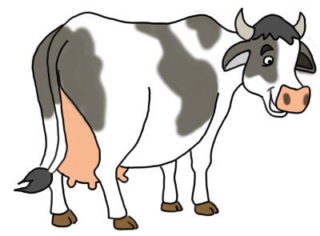

La vaca que riu
======================
Un empresari d'un poble vol obrir una botiga de llet en una ciutat. Vol que el negoci tingui èxit i per això vol que la llet sigui fresca i natural. Però resulta que és una mica avar i per això en comptes de portar la llet cada dia ha decidit que portarà les vaques a la ciutat.

El problema és que no vol gastar gaire, no sigui que el negoci no funcioni bé. Per això quan ha fet comptes descobreix que només pot llogar un camió que pot portar una càrrega com a màxim (i només un sol cop)

L'objectiu serà triar les vaques que ha de portar en el camió de manera que es pugui fer el màxim de producció de llet amb un sol viatge.

    Exemple
    Es té un camió que pot portar com a màxim 700 kg i pot triar entre les vaques següents :

    | Nom     | Pes   | Raça              | Color          | Litres/dia |
    | Maria   | 360kg | Holstein-Friesian | Blanca i negra | 40 litres  |
    | Pepa    | 250kg | Jersey            | Marró          | 35 litres  |
    | Flor    | 400kg | Simental          | Blanca i marró | 43 litres  |
    | Toñi    | 180kg | Jersey            | Marró          | 28 litres  |
    | Conxita |  50kg | Gernsey           | Blanca         | 12 litres  |
    | Blanca  |  90kg | Ayshire           | Blanca i marró | 13 litres  |

Un dels problemes és que les vaques són tan amigues que només volen anar en l'ordre en que han viscut normalment: La Pepa va al davant o bé rere la Maria, La Toñi o és la primera o seguirà a la Flor, etc...

O sigui que el resultat serà:

    Flor, Toñi, Conxita 630kg - 83 litres

 Els resultats parcials calculats són:

     1. Maria, Pepa: 610 kg - 75 litres
     2. Pepa, Flor: 650 kg - 78 litres
     3. Flor, Toñi, Conxita: 630 kg - 83 litres
     4. Toñi, Conxita, Blanca: 320 kg - 53 litres
     5. Conxita, Blanca: 140 kg - 25 litres
     6. Blanca: 90 kg - 13 litres
